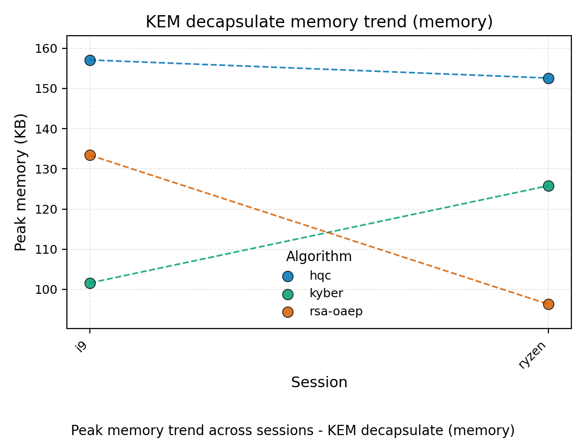

# Graph Captions

Latency trend across sessions - KEM decapsulate (memory)

Latency trend across sessions - KEM encapsulate (memory)

Latency trend across sessions - KEM keygen (memory)

Latency trend across sessions - SIG keygen (memory)

Latency trend across sessions - SIG sign (memory)

Latency trend across sessions - SIG verify (memory)

Latency trend across sessions - KEM decapsulate (timing)

Latency trend across sessions - KEM encapsulate (timing)

Latency trend across sessions - KEM keygen (timing)

Latency trend across sessions - SIG keygen (timing)

Latency trend across sessions - SIG sign (timing)

Latency trend across sessions - SIG verify (timing)

Peak memory trend across sessions - KEM decapsulate (memory)

Peak memory trend across sessions - KEM encapsulate (memory)

Peak memory trend across sessions - KEM keygen (memory)

Peak memory trend across sessions - SIG keygen (memory)

Peak memory trend across sessions - SIG sign (memory)

Peak memory trend across sessions - SIG verify (memory)
