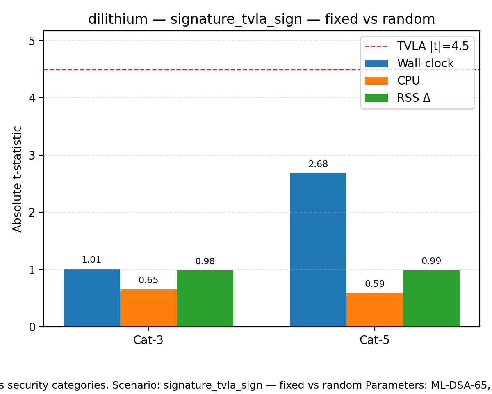
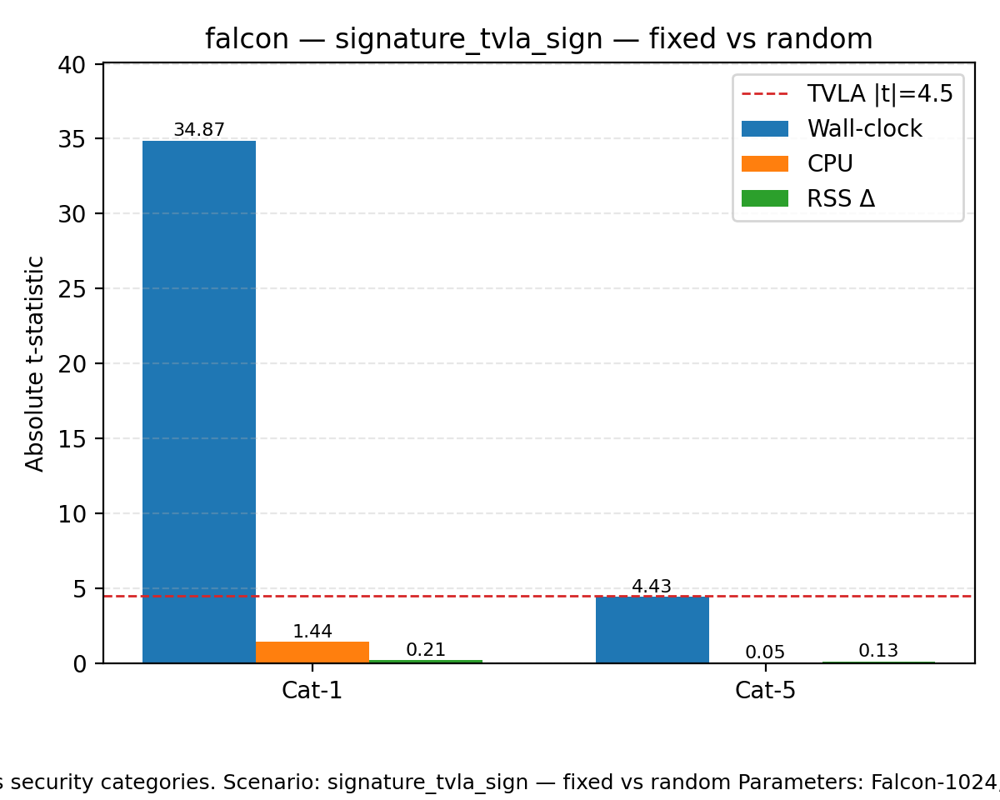
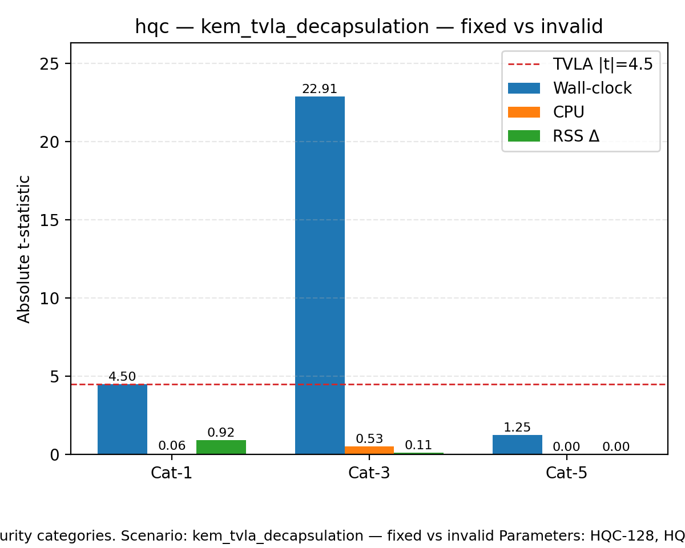
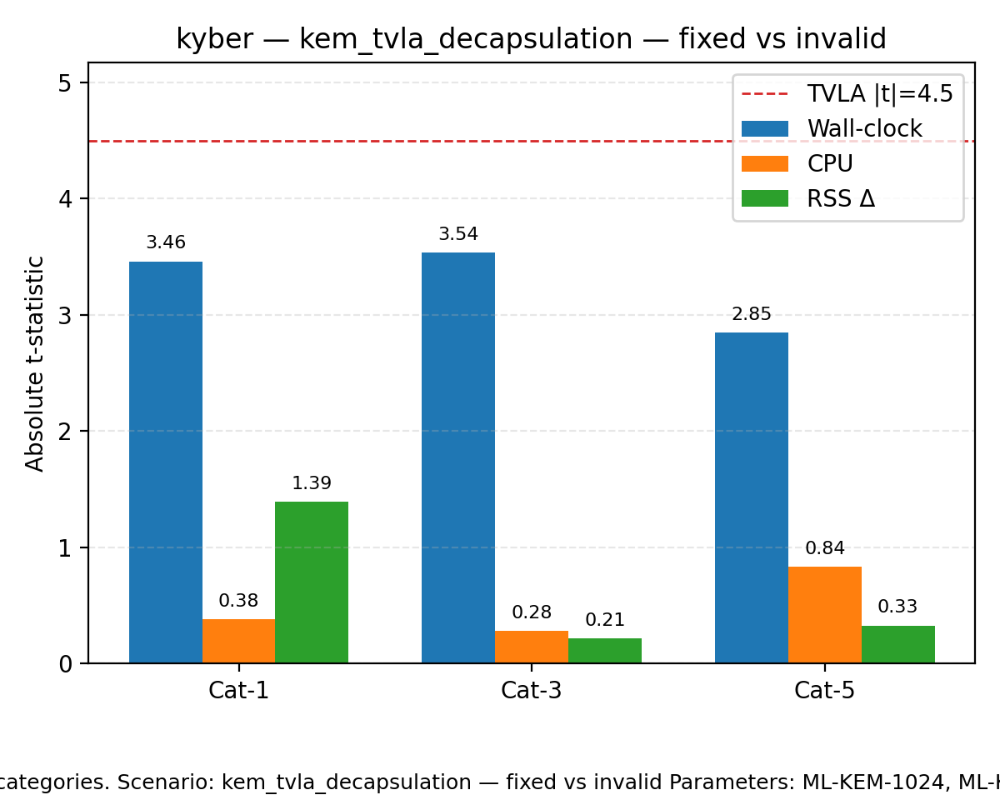
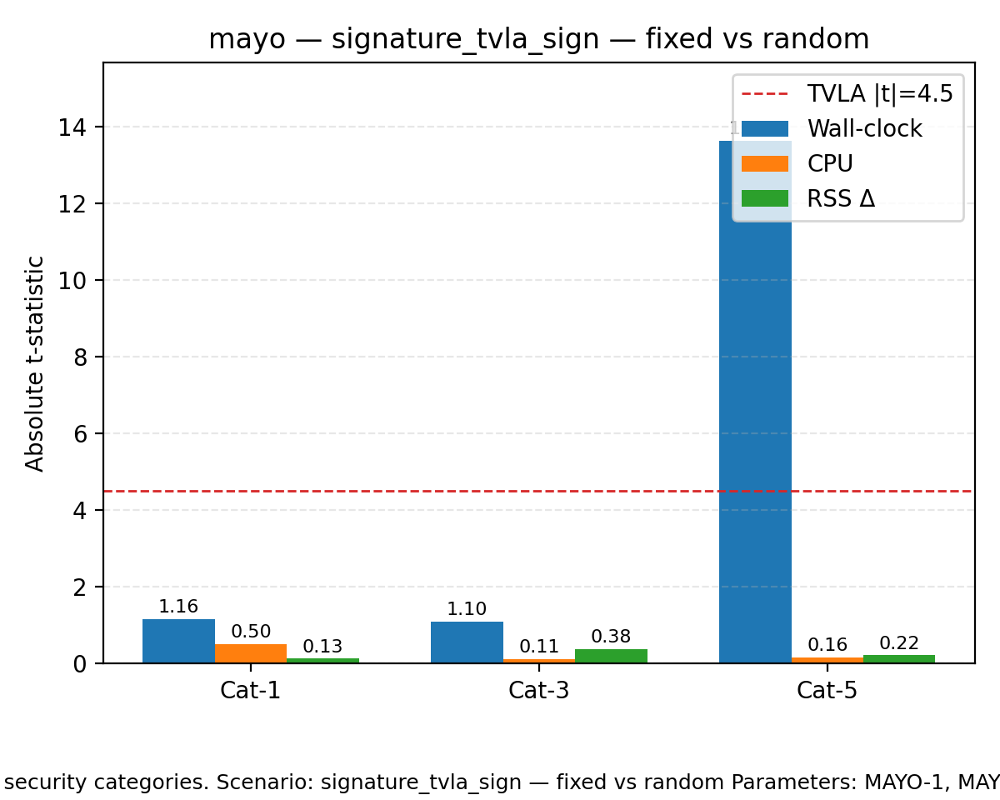
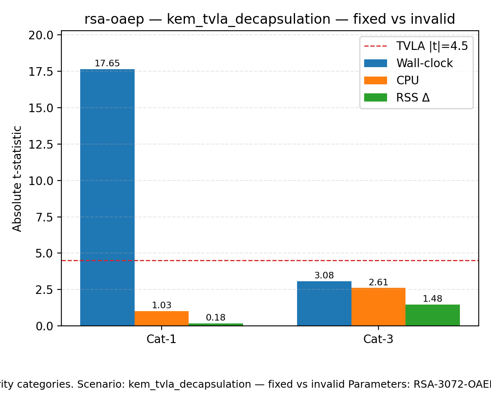
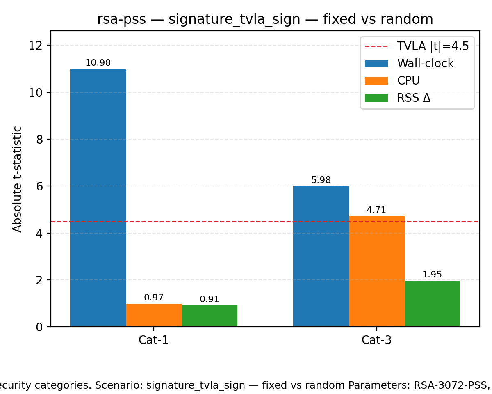

# Side-Channel Plots

|t|-statistics for wall-clock (time), CPU, and RSS deltas across security categories. Scenario: signature_tvla_sign — fixed vs random Parameters: ML-DSA-65, ML-DSA-87 Dashed line marks the TVLA threshold (|t|=4.5).

|t|-statistics for wall-clock (time), CPU, and RSS deltas across security categories. Scenario: signature_tvla_sign — fixed vs random Parameters: Falcon-1024, Falcon-512 Dashed line marks the TVLA threshold (|t|=4.5).

|t|-statistics for wall-clock (time), CPU, and RSS deltas across security categories. Scenario: kem_tvla_decapsulation — fixed vs invalid Parameters: HQC-128, HQC-192, HQC-256 Dashed line marks the TVLA threshold (|t|=4.5).

|t|-statistics for wall-clock (time), CPU, and RSS deltas across security categories. Scenario: kem_tvla_decapsulation — fixed vs invalid Parameters: ML-KEM-1024, ML-KEM-512, ML-KEM-768 Dashed line marks the TVLA threshold (|t|=4.5).

|t|-statistics for wall-clock (time), CPU, and RSS deltas across security categories. Scenario: signature_tvla_sign — fixed vs random Parameters: MAYO-1, MAYO-3, MAYO-5 Dashed line marks the TVLA threshold (|t|=4.5).

|t|-statistics for wall-clock (time), CPU, and RSS deltas across security categories. Scenario: kem_tvla_decapsulation — fixed vs invalid Parameters: RSA-3072-OAEP, RSA-7680-OAEP Dashed line marks the TVLA threshold (|t|=4.5).

|t|-statistics for wall-clock (time), CPU, and RSS deltas across security categories. Scenario: signature_tvla_sign — fixed vs random Parameters: RSA-3072-PSS, RSA-7680-PSS Dashed line marks the TVLA threshold (|t|=4.5).

|t|-statistics for wall-clock (time), CPU, and RSS deltas across security categories. Scenario: signature_tvla_sign — fixed vs random Parameters: SPHINCS+-SHAKE-128s-simple, SPHINCS+-SHAKE-192s-simple, SPHINCS+-SHAKE-256s-simple Dashed line marks the TVLA threshold (|t|=4.5).
