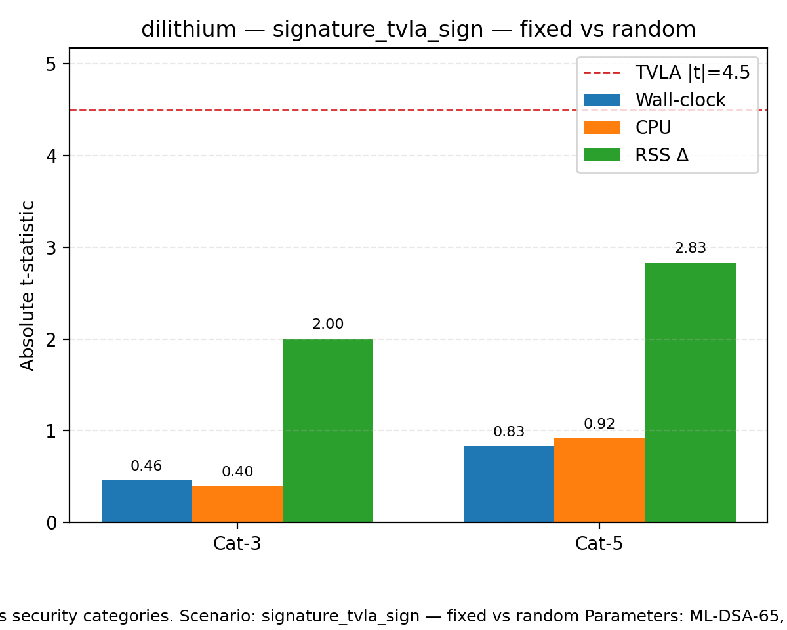
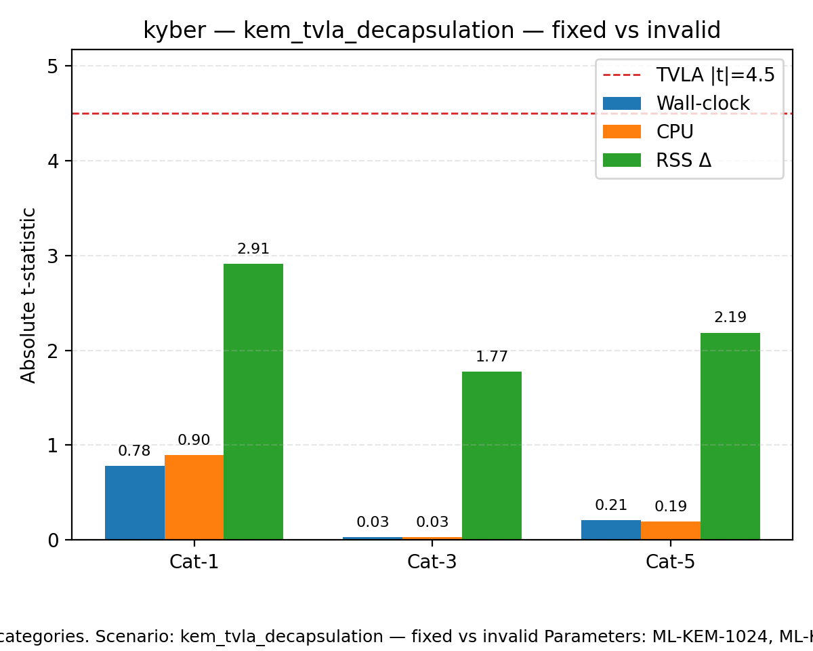

# Side-Channel Plots

|t|-statistics for wall-clock (time), CPU, and RSS deltas across security categories. Scenario: signature_tvla_sign — fixed vs random Parameters: ML-DSA-65, ML-DSA-87 Dashed line marks the TVLA threshold (|t|=4.5).

|t|-statistics for wall-clock (time), CPU, and RSS deltas across security categories. Scenario: kem_tvla_decapsulation — fixed vs invalid Parameters: ML-KEM-1024, ML-KEM-512, ML-KEM-768 Dashed line marks the TVLA threshold (|t|=4.5).
