# Side-Channel Plots

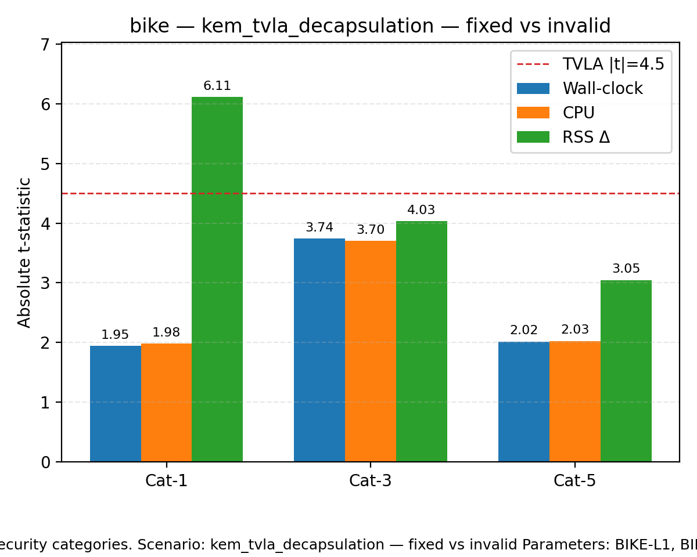

|t|-statistics for wall-clock (time), CPU, and RSS deltas across security categories. Scenario: kem_tvla_decapsulation — fixed vs invalid Parameters: BIKE-L1, BIKE-L3, BIKE-L5 Dashed line marks the TVLA threshold (|t|=4.5).

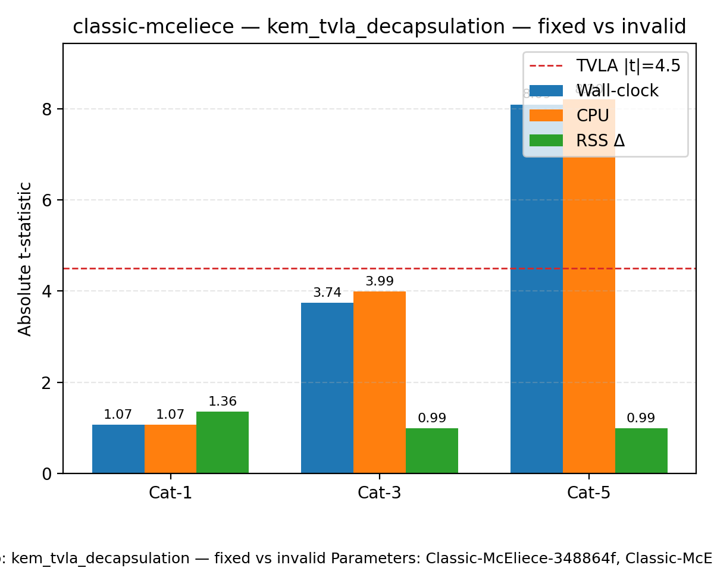

|t|-statistics for wall-clock (time), CPU, and RSS deltas across security categories. Scenario: kem_tvla_decapsulation — fixed vs invalid Parameters: Classic-McEliece-348864f, Classic-McEliece-460896f, Classic-McEliece-6688128f Dashed line marks the TVLA threshold (|t|=4.5).

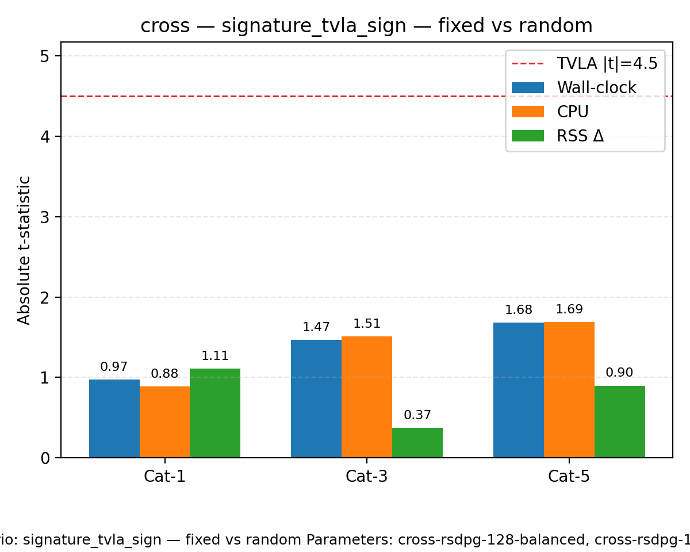

|t|-statistics for wall-clock (time), CPU, and RSS deltas across security categories. Scenario: signature_tvla_sign — fixed vs random Parameters: cross-rsdpg-128-balanced, cross-rsdpg-192-balanced, cross-rsdpg-256-balanced Dashed line marks the TVLA threshold (|t|=4.5).

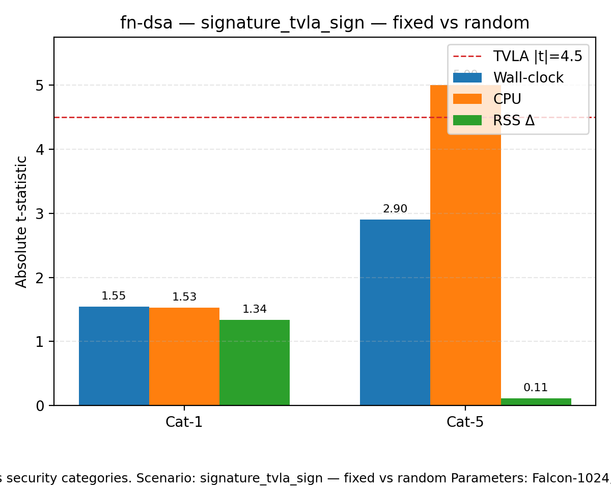

|t|-statistics for wall-clock (time), CPU, and RSS deltas across security categories. Scenario: signature_tvla_sign — fixed vs random Parameters: Falcon-1024, Falcon-512 Dashed line marks the TVLA threshold (|t|=4.5).

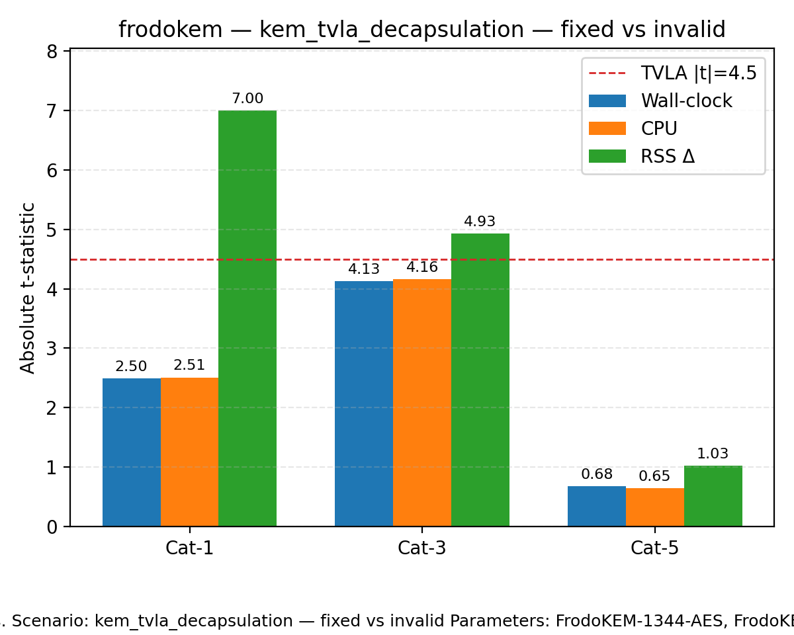

|t|-statistics for wall-clock (time), CPU, and RSS deltas across security categories. Scenario: kem_tvla_decapsulation — fixed vs invalid Parameters: FrodoKEM-1344-AES, FrodoKEM-640-AES, FrodoKEM-976-AES Dashed line marks the TVLA threshold (|t|=4.5).

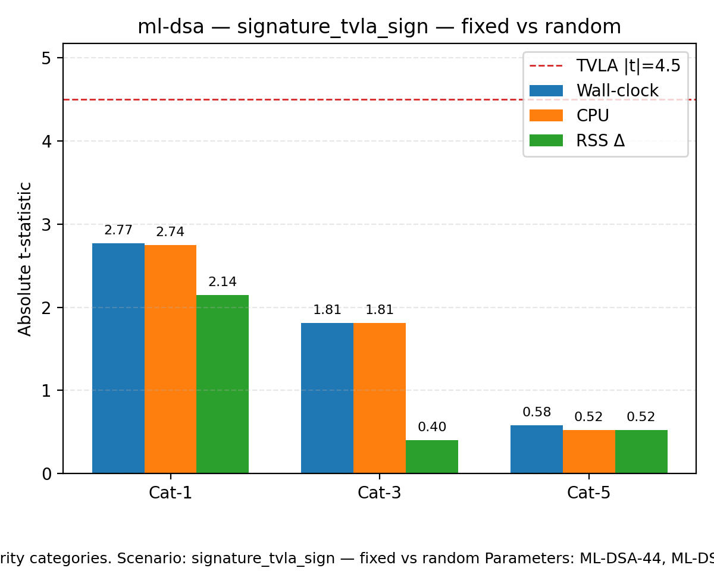

|t|-statistics for wall-clock (time), CPU, and RSS deltas across security categories. Scenario: signature_tvla_sign — fixed vs random Parameters: ML-DSA-44, ML-DSA-65, ML-DSA-87 Dashed line marks the TVLA threshold (|t|=4.5).

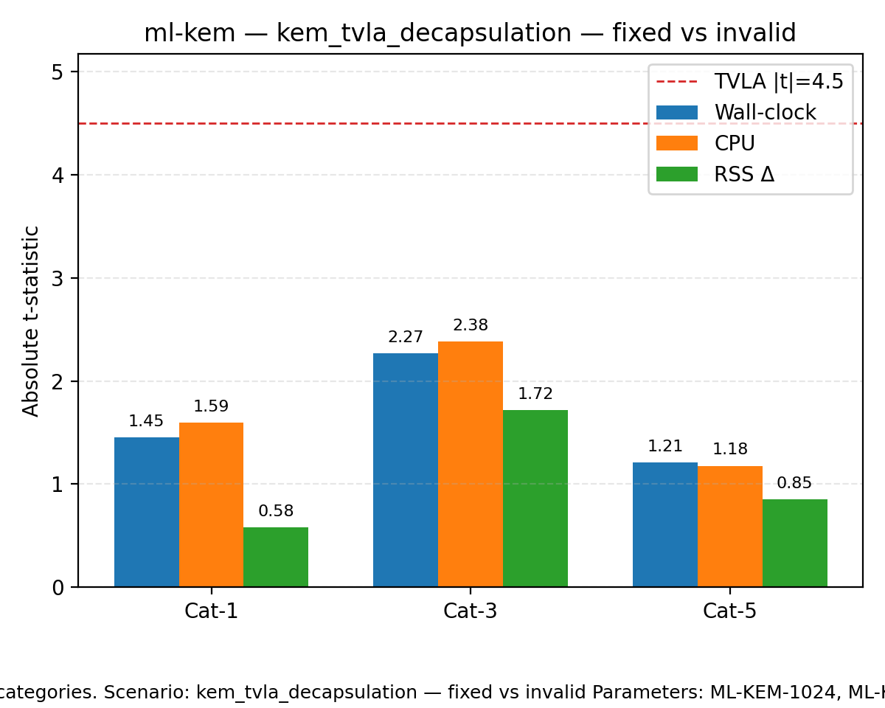

|t|-statistics for wall-clock (time), CPU, and RSS deltas across security categories. Scenario: kem_tvla_decapsulation — fixed vs invalid Parameters: ML-KEM-1024, ML-KEM-512, ML-KEM-768 Dashed line marks the TVLA threshold (|t|=4.5).

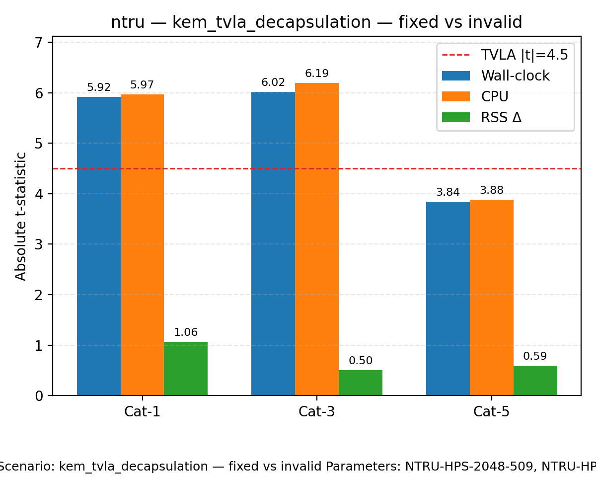

|t|-statistics for wall-clock (time), CPU, and RSS deltas across security categories. Scenario: kem_tvla_decapsulation — fixed vs invalid Parameters: NTRU-HPS-2048-509, NTRU-HPS-2048-677, NTRU-HPS-4096-821 Dashed line marks the TVLA threshold (|t|=4.5).

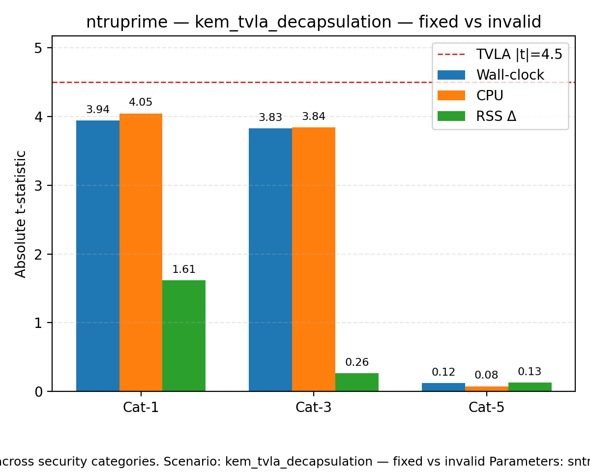

|t|-statistics for wall-clock (time), CPU, and RSS deltas across security categories. Scenario: kem_tvla_decapsulation — fixed vs invalid Parameters: sntrup761 Dashed line marks the TVLA threshold (|t|=4.5).

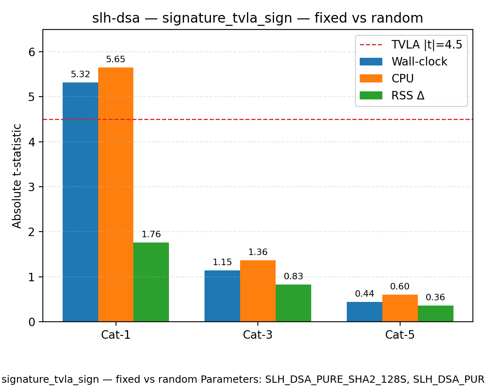

|t|-statistics for wall-clock (time), CPU, and RSS deltas across security categories. Scenario: signature_tvla_sign — fixed vs random Parameters: SLH_DSA_PURE_SHA2_128S, SLH_DSA_PURE_SHA2_192S, SLH_DSA_PURE_SHA2_256S Dashed line marks the TVLA threshold (|t|=4.5).

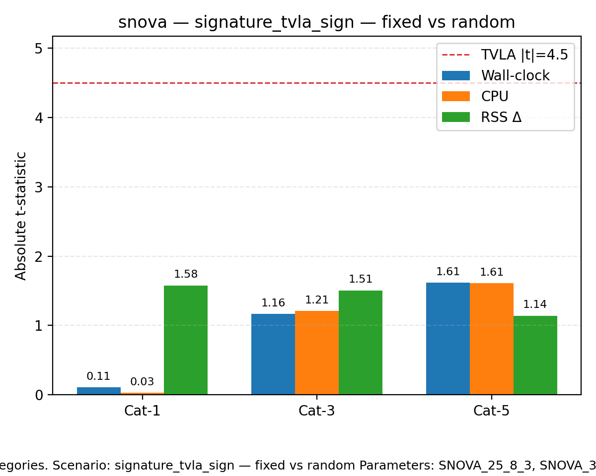

|t|-statistics for wall-clock (time), CPU, and RSS deltas across security categories. Scenario: signature_tvla_sign — fixed vs random Parameters: SNOVA_25_8_3, SNOVA_37_17_2, SNOVA_60_10_4 Dashed line marks the TVLA threshold (|t|=4.5).

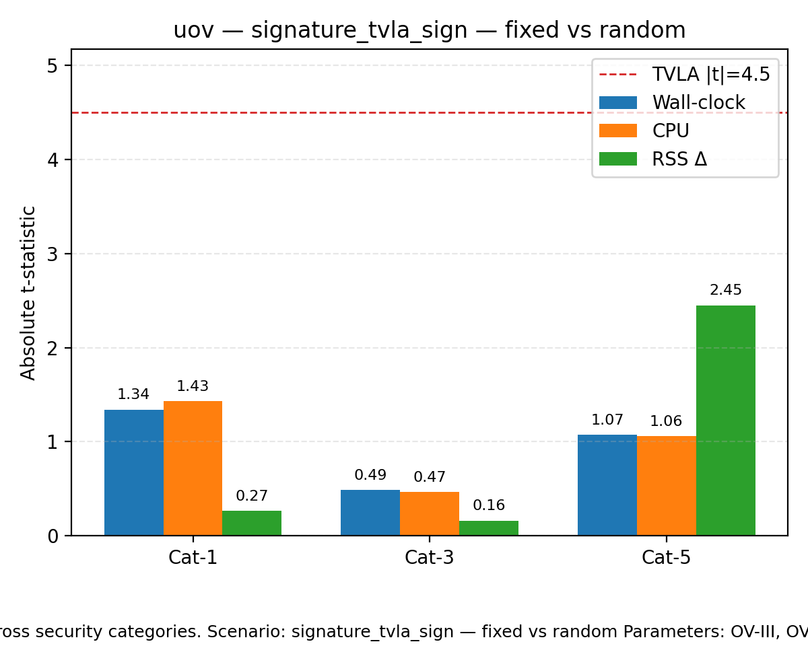

|t|-statistics for wall-clock (time), CPU, and RSS deltas across security categories. Scenario: signature_tvla_sign — fixed vs random Parameters: OV-III, OV-Is, OV-V Dashed line marks the TVLA threshold (|t|=4.5).

|t|-statistics for wall-clock (time), CPU, and RSS deltas across security categories. Scenario: signature_tvla_sign — fixed vs random Parameters: ML-DSA-65, ML-DSA-87 Dashed line marks the TVLA threshold (|t|=4.5).

|t|-statistics for wall-clock (time), CPU, and RSS deltas across security categories. Scenario: signature_tvla_sign — fixed vs random Parameters: Falcon-1024, Falcon-512 Dashed line marks the TVLA threshold (|t|=4.5).

|t|-statistics for wall-clock (time), CPU, and RSS deltas across security categories. Scenario: kem_tvla_decapsulation — fixed vs invalid Parameters: HQC-128, HQC-192, HQC-256 Dashed line marks the TVLA threshold (|t|=4.5).

|t|-statistics for wall-clock (time), CPU, and RSS deltas across security categories. Scenario: kem_tvla_decapsulation — fixed vs invalid Parameters: ML-KEM-1024, ML-KEM-512, ML-KEM-768 Dashed line marks the TVLA threshold (|t|=4.5).

|t|-statistics for wall-clock (time), CPU, and RSS deltas across security categories. Scenario: signature_tvla_sign — fixed vs random Parameters: MAYO-1, MAYO-3, MAYO-5 Dashed line marks the TVLA threshold (|t|=4.5).

|t|-statistics for wall-clock (time), CPU, and RSS deltas across security categories. Scenario: kem_tvla_decapsulation — fixed vs invalid Parameters: RSA-3072-OAEP, RSA-7680-OAEP Dashed line marks the TVLA threshold (|t|=4.5).

|t|-statistics for wall-clock (time), CPU, and RSS deltas across security categories. Scenario: signature_tvla_sign — fixed vs random Parameters: RSA-3072-PSS, RSA-7680-PSS Dashed line marks the TVLA threshold (|t|=4.5).

|t|-statistics for wall-clock (time), CPU, and RSS deltas across security categories. Scenario: signature_tvla_sign — fixed vs random Parameters: SPHINCS+-SHAKE-128s-simple, SPHINCS+-SHAKE-192s-simple, SPHINCS+-SHAKE-256s-simple Dashed line marks the TVLA threshold (|t|=4.5).
